# Technical Documentation

## Architecture Overview

HandyPlaylistPlayer uses **Vertical Slice Architecture** with a custom CQRS dispatcher (no MediatR). Each user action is modeled as a command or query with its own handler and optional validator. Stateful runtime services (playback coordinator, queue, tick engine) remain as singletons orchestrated by thin command handlers.

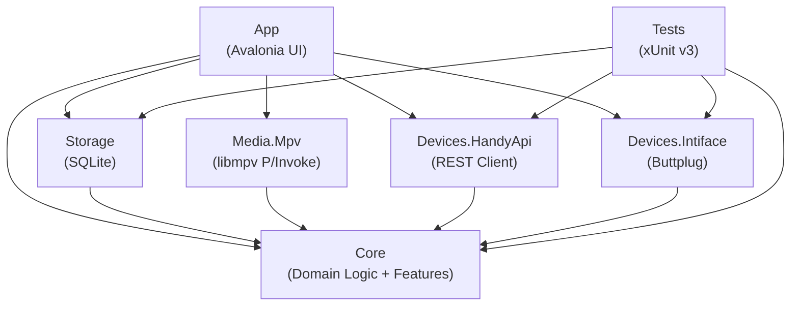

All infrastructure projects depend **only on Core** (never on each other). The App project wires everything together via dependency injection.

---

## Solution Structure

```
HandyPlaylistPlayer.sln
├── global.json                  # Pins .NET 10 SDK
├── Directory.Build.props        # Shared build settings (TFM, nullable, lang version)
│
├── src/
│   ├── HandyPlaylistPlayer.App/           # Avalonia UI, Views, ViewModels, DI bootstrap
│   ├── HandyPlaylistPlayer.Core/          # Domain logic, features, dispatching
│   │   ├── Dispatching/                   # CQRS infrastructure (IDispatcher, handlers, validators)
│   │   ├── Features/                      # Vertical slices (Command/Query + Handler + Validator)
│   │   │   ├── Library/                   # Scan, AddRoot, RemoveRoot, GetItems, AutoPairing, Delete, Watched, FindDuplicates
│   │   │   ├── Playback/                  # LoadMedia, PlayPause, Stop, Seek, EmergencyStop
│   │   │   ├── Queue/                     # Enqueue, Reorder, Next, Previous, Shuffle, Clear
│   │   │   ├── Device/                    # Connect, Disconnect, UpdateTransformSettings
│   │   │   ├── Playlists/                 # CRUD for playlists and playlist items
│   │   │   ├── Presets/                   # CRUD for override presets
│   │   │   ├── Settings/                  # Get/Save app settings
│   │   │   └── PatternMode/              # Generate device patterns
│   │   ├── Runtime/                       # Stateful singleton services
│   │   ├── Models/                        # Domain models
│   │   ├── Interfaces/                    # Infrastructure port interfaces
│   │   └── Services/                      # Shared services (parser, indexer, etc.)
│   ├── HandyPlaylistPlayer.Media.Mpv/     # libmpv P/Invoke adapter (IMediaPlayer)
│   ├── HandyPlaylistPlayer.Devices.HandyApi/  # Handy REST API v2 + Hosting + Time Sync
│   ├── HandyPlaylistPlayer.Devices.Intiface/  # Buttplug.NET client (IDeviceBackend)
│   └── HandyPlaylistPlayer.Storage/       # SQLite database, migrations, repositories
│
└── tests/
    └── HandyPlaylistPlayer.Tests/         # xUnit v3 + NSubstitute
```

### Project Responsibilities

| Project | Purpose | Key NuGet Packages |
|---|---|---|
| **App** | UI shell, MVVM ViewModels, DI composition root | Avalonia 11.2, CommunityToolkit.Mvvm, Serilog |
| **Core** | Feature slices, dispatching, runtime services, models | System.IO.Abstractions, M.E.DI.Abstractions |
| **Media.Mpv** | Embedded video player via libmpv | (no NuGet — P/Invoke directly to `libmpv-2.dll`) |
| **Devices.HandyApi** | Handy device control via HSSP/HDSP protocols | System.Net.Http.Json |
| **Devices.Intiface** | Device control via Intiface Central | Buttplug 5.0.0 |
| **Storage** | SQLite persistence, schema migrations | Microsoft.Data.Sqlite 10.0 |
| **Tests** | Unit tests with mocked dependencies | xunit.v3 3.2, NSubstitute 5.3 |

---

## Design Patterns

### Vertical Slice Architecture (CQRS)

Each user action is a **command** (write) or **query** (read), paired with a handler and optional validator. A lightweight custom `IDispatcher` resolves handlers via the DI container (no MediatR). Handler resolution uses compiled expression trees cached per command/query type — zero reflection overhead after the first call.

```
Feature Slice Structure:
Features/
  Playback/
    PlayPause/
      PlayPauseCommand.cs       # record PlayPauseCommand(bool IsPlaying) : ICommand
      PlayPauseHandler.cs       # Thin wrapper over IPlaybackCoordinator
    LoadMedia/
      LoadMediaCommand.cs       # record LoadMediaCommand(string VideoPath, string? ScriptPath) : ICommand
      LoadMediaHandler.cs
      LoadMediaValidator.cs     # Validates video path is non-empty
```

**Key design decisions:**
- **Stateful services stay as singletons** — `PlaybackCoordinator`, `QueueService`, `StreamingTickEngine` maintain live state and are orchestrated by thin command handlers in `Core/Runtime/`
- **Hot paths bypass the dispatcher** — TransformSettings slider updates and the 20Hz tick loop call services directly for zero-overhead response
- **ViewModels subscribe to runtime service events** — Push-based UI updates via `PositionChanged`, `PlaybackStateChanged`, etc.
- **Validators are optional** — Only added where input validation genuinely prevents errors (8 validators across ~30 handlers)

**Dispatcher flow:**
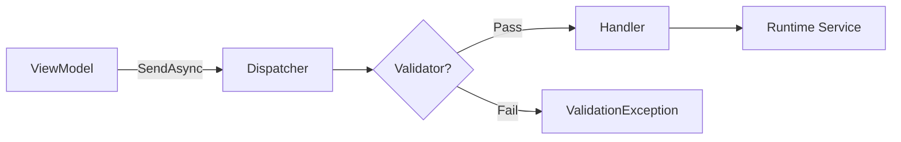

### MVVM (Model-View-ViewModel)

The UI layer uses **CommunityToolkit.Mvvm** source generators:

- `[ObservableProperty]` generates `INotifyPropertyChanged` boilerplate
- `[RelayCommand]` generates `ICommand` implementations from methods
- `partial void On<Property>Changed()` hooks react to property changes

Navigation uses a **ViewModel-first** approach with `ViewLocator` mapping ViewModel types to View types. `MainViewModel.CurrentPage` drives which page is displayed.

ViewModels inject `IDispatcher` for user actions and runtime service interfaces for event subscriptions only:

```csharp
// User action → dispatcher
await _dispatcher.SendAsync(new PlayPauseCommand(IsPlaying));

// Push UI updates ← runtime service events
_coordinator.PlaybackStateChanged += (_, state) => { ... };
```

### Dependency Injection

All services are registered in `App.axaml.cs` using `Microsoft.Extensions.DependencyInjection`:

- **Singletons**: Repositories, runtime services, device backends, `IDispatcher`, ViewModels (each VM subscribes to singleton service events in its constructor)
- **Transient**: Command/query handlers, validators

### Repository Pattern

Each database table has a corresponding repository class with async CRUD methods. Repositories use `Microsoft.Data.Sqlite` directly (no ORM) for full control over queries. All repositories have corresponding interfaces (`IPlaylistRepository`, `IPresetRepository`, etc.) for testability.

### Strategy Pattern (Device Backends)

`IDeviceBackend` abstracts device communication. Two implementations exist:

- `HandyApiClient` — HSSP or HDSP mode via REST API (configurable in Settings). HSSP uploads scripts for server-synced playback with periodic resync. HDSP streams positions in real-time via the tick engine.
- `IntifaceDeviceClient` — Streaming mode via Buttplug WebSocket (always uses tick engine)

The `PlaybackCoordinator` branches on the backend's `IsStreamingMode` property: streaming modes (HDSP, Intiface) use the `StreamingTickEngine`, while HSSP uses server-side playback with resync.

---

## Core Services

### Playback Coordinator

The central orchestrator managing media playback and device synchronization.

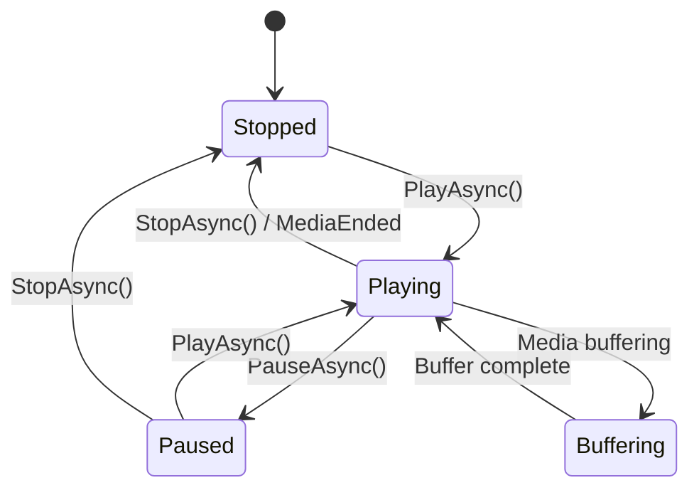

**Tri-mode operation:**

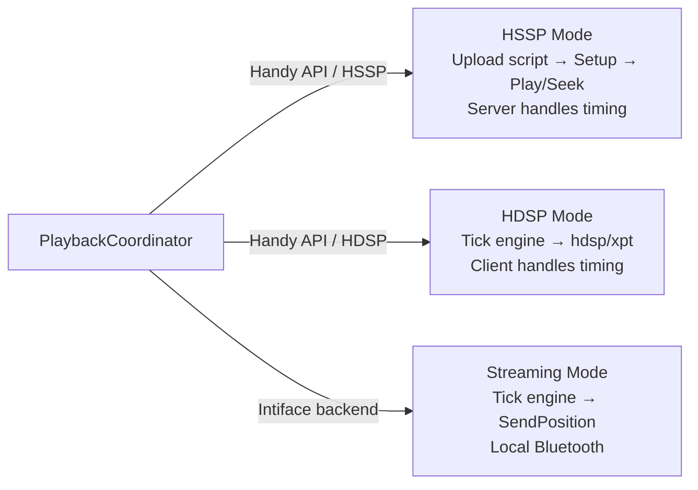

- **HSSP Mode** (Handy API, mode 1): Scripts are uploaded to the Handy hosting service, then playback commands reference server-synced timestamps. Periodic resync detects and corrects drift (soft every 10s via `/hssp/synctime`, hard on >500ms drift via stop+play). Override controls do not apply — the server plays the raw uploaded script.
- **HDSP Mode** (Handy API, mode 2): A `StreamingTickEngine` interpolates positions and sends them via `PUT /hdsp/xpt` with fire-and-forget HTTP. Override controls (range, invert, intensity, edging, smoothing, speed limit) apply in real-time via the 7-stage transform pipeline.
- **Streaming Mode** (Intiface): Same tick engine as HDSP, but sends positions over local Buttplug WebSocket. No cloud dependency.

### Script Transform Pipeline

Transforms are applied in a fixed order to ensure predictable behavior. Only active in HDSP and Intiface streaming modes (HSSP plays the raw script server-side).


Each transform is optional and controlled by `TransformSettings`:

| Transform | Setting | Effect |
|---|---|---|
| Invert | `Invert = true` | Flips position: `100 - pos` |
| Range Scale | `RangeMin`, `RangeMax` | Maps 0-100 to min-max range (movement limits) |
| Intensity | `Intensity` (0-100%) | Scales movement amplitude around midpoint without changing range limits |
| Clamp | (always) | Ensures output stays within 0-100 |
| Edging Throttle | `EdgingEnabled`, `EdgingThreshold`, `EdgingReduction` | Automatically moderates high-intensity sequences above the speed threshold |
| Smoothing | `SmoothingFactor` (0-1) | Exponential moving average: `smoothed = prev * factor + current * (1 - factor)` |
| Speed Limit | `SpeedLimit` | Max position change per second |

### Auto-Pairing Engine

Automatically matches video files with their funscript counterparts:

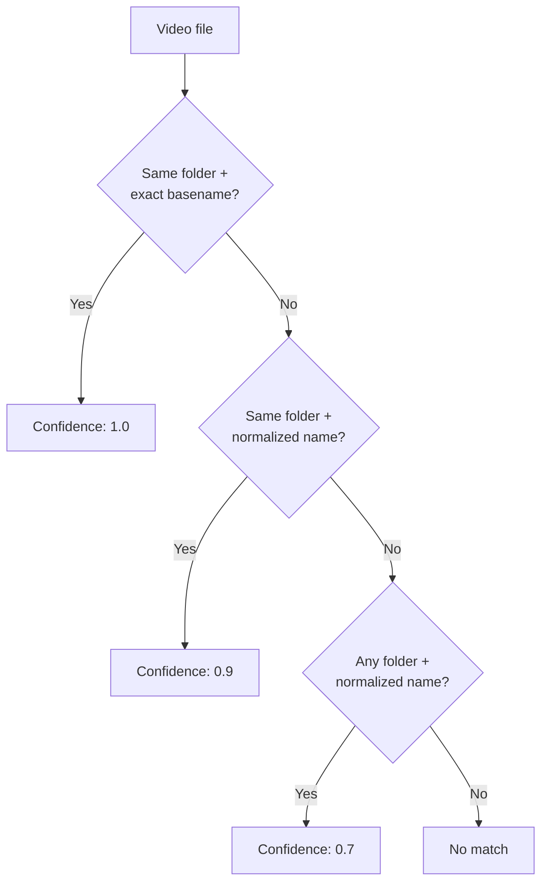

**Filename normalization** strips brackets, known tags (1080p, 4k, x264, hevc, etc.), replaces separators, and lowercases for fuzzy matching.

Manual pairings (user overrides) are never replaced by auto-pairing.

### Streaming Tick Engine

For HDSP and Intiface/Buttplug backends, the tick engine provides real-time position streaming:

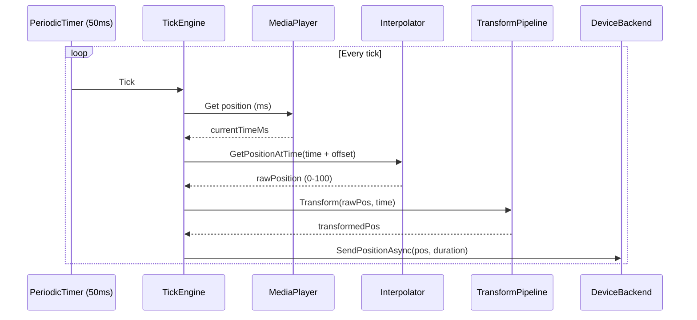

Features:
- 10ms tick rate for responsive position updates
- Action-based targeting: sends the next funscript action's target position and remaining duration
- Fire-and-forget HTTP sends (HDSP) to avoid blocking the tick loop
- Late-frame handling (skips intermediate positions)
- Periodic summary logging every 5s for diagnostics

### Queue Service

Manages the playback queue with multiple shuffle modes:

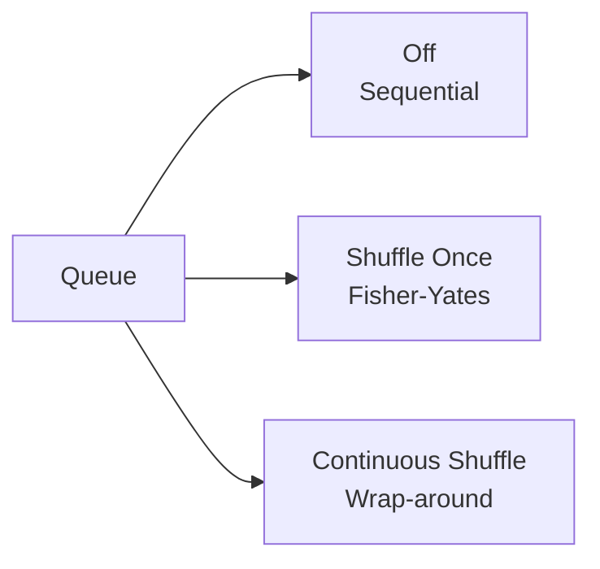

Features: enqueue, reorder, remove, next/previous with history, insert-next.

---

## Database Schema

SQLite database with a migration system. Migrations are embedded SQL resources applied in order on startup.

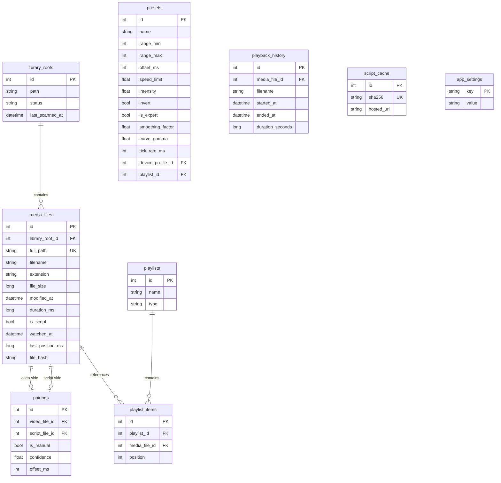

Migration system: `DatabaseMigrator` reads `schema_version` table, applies pending `NNN_*.sql` files in order within transactions. Multi-statement migrations are split by `;` and executed individually.

**Performance PRAGMAs** (applied on every connection open):

| PRAGMA | Value | Purpose |
|---|---|---|
| `foreign_keys` | `ON` | Enforce referential integrity |
| `journal_mode` | `WAL` | Write-ahead logging for concurrent read/write |
| `synchronous` | `NORMAL` | Faster writes with WAL (safe — WAL provides crash recovery) |
| `cache_size` | `-8000` | 8MB page cache (negative = KiB) |
| `mmap_size` | `30000000` | 30MB memory-mapped I/O for faster reads |
| `temp_store` | `MEMORY` | Temp tables in memory instead of disk |

**Migrations** (8 total): 001 initial schema, 002 watched tracking, 003 last position, 004 playback history, 005 preset intensity, 006 file hash, 007 missing indexes, 008 pairing offset.

**Indexes** (migrations 006-007):

| Table | Index | Purpose |
|---|---|---|
| `media_files` | `file_hash` | Duplicate detection by partial SHA-256 |
| `pairings` | `video_file_id` | FK lookup |
| `pairings` | `script_file_id` | FK lookup |
| `pairings` | `(video_file_id, is_manual DESC, confidence DESC)` | Optimal pairing resolution |
| `playlist_items` | `playlist_id` | FK lookup |
| `playlist_items` | `media_file_id` | FK lookup |
| `presets` | `device_profile_id` | FK lookup |
| `presets` | `playlist_id` | FK lookup |
| `playback_history` | `(started_at DESC, media_file_id)` | Recent items query |

---

## Handy API Integration

### HSSP vs HDSP — When to Use Which

| | **HSSP** (Server-Synced) | **HDSP** (Direct Streaming) |
|---|---|---|
| **How it works** | Script uploaded once; server handles all timing | Client sends positions in real-time via tick engine |
| **Network traffic** | Low — only play/stop/seek + resync every 10s | High — one HTTP request per action transition (~10-50/s) |
| **Override controls** | Not applied (server plays raw script) | Applied in real-time (range, invert, intensity, edging, smoothing, speed limit) |
| **Sync accuracy** | Excellent — server manages timing internally | Good — depends on network latency and VLC time granularity |
| **Seek** | Stop + play at new position (fast) | Automatic — tick engine picks up new position |
| **Resync** | Automatic drift detection (soft/hard) | Not needed — positions sent continuously |
| **Setup time** | Slower — requires script upload + setup | Instant — starts streaming immediately |
| **Cloud dependency** | Yes (both modes use Handy cloud API) | Yes (both modes use Handy cloud API) |
| **Best for** | Long sessions, hands-off playback | When you need real-time override adjustments |

**Recommendation:** Use **HSSP** as the default for most users (simpler, lower traffic, reliable timing). Switch to **HDSP** if you need real-time override control during playback.

### HSSP Protocol Flow

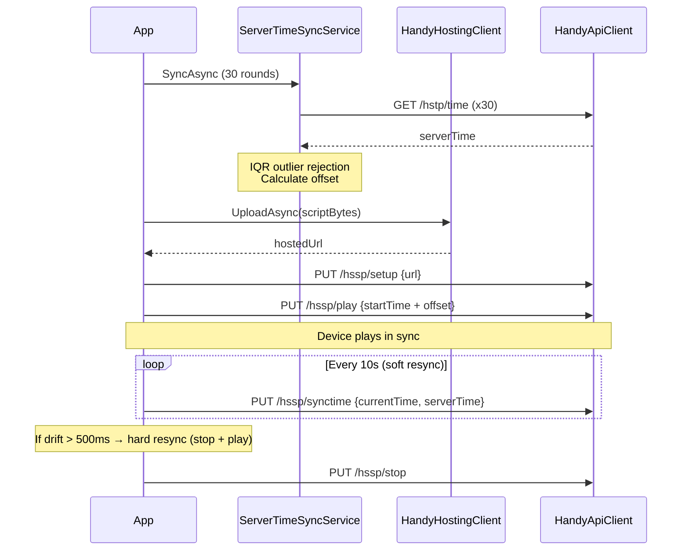

### HDSP Protocol Flow

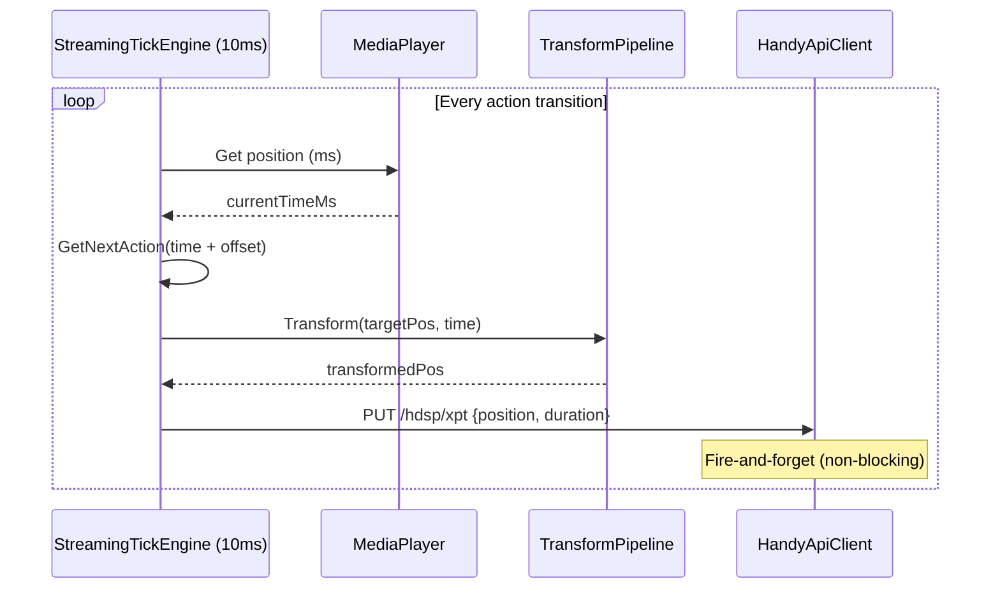

**Key details:**
- Server time sync uses 30 RTD measurements with IQR-based outlier rejection
- Script hosting caches by SHA-256 hash to avoid re-uploads
- All API calls have exponential backoff retry (3 attempts)
- `Interlocked` used for thread-safe offset access
- HDSP sends use fire-and-forget async void to avoid blocking the tick loop
- Protocol mode (HSSP/HDSP) is selectable in Settings and persisted in the database

---

## Constants & Code Quality

Magic strings are centralized in `Core/Constants.cs` and `Core/SettingKeys.cs`:

| Constant Class | Purpose |
|---|---|
| `BackendTypes` | Device backend identifiers (`handy_api`, `intiface`) |
| `ProtocolNames` | Protocol string identifiers (`hssp`, `hdsp`) |
| `HandyDeviceModes` | Handy API mode numbers (0=HAMP, 1=HSSP, 2=HDSP) |
| `PlaylistTypes` | Playlist type identifiers (`static`, `smart`, `folder`) |
| `SettingKeys` | All `app_settings` table keys |

**Resource management patterns:**
- All `HttpResponseMessage` objects are disposed via `using` declarations
- `StringContent` for HTTP requests is explicitly disposed
- `CancellationTokenSource` instances are disposed when replaced
- `DispatcherTimer` event handlers are unsubscribed before disposal
- `JsonDocument` instances are disposed via `using` declarations
- `StreamWriter` trace files are closed in `finally` blocks
- `SemaphoreSlim` locks disposed in `Dispose()` (PlaybackCoordinator)
- `Interlocked` operations for thread-safe field access (RTT offset)
- `SafeFireAndForget` pattern logs exceptions from fire-and-forget tasks

**mpv initialization options:**
- `--pause=yes` — loads the first frame without auto-playing (no resume-seek-pause dance needed)
- `--keep-open=yes` — stays on last frame at end of file rather than closing
- `--hwdec=auto` — hardware decode (configurable in Settings; applies live, no restart)
- `--hr-seek=yes` — high-precision seek updates the displayed frame even while paused
- `--vo=gpu` / `--vo=gpu-next` — VO backend: `gpu` is stable default; `gpu-next` is the modern renderer with better GLSL shader support and improved HDR. Requires restart. Set before `mpv_initialize()`.
- `--scale=spline36` — luma upscaling filter (configurable; overridden by GLSL shader presets)
- `--deband=yes/no` — debanding filter (configurable, applies live)
- `--af=loudnorm` — EBU R128 loudness normalization (configurable, applies live)
- `--icc-profile-auto` — ICC color profile (configurable)
- `--tone-mapping` — HDR tone mapping strategy (configurable)
- Demuxer cache size configurable (applies live via `demuxer-max-bytes`)

**GLSL shader presets** (set via `change-list glsl-shaders append` after `mpv_initialize()`):

| Preset | Files / Option | Best For |
|---|---|---|
| None | — | Any content; standard `spline36` filter, no GPU overhead |
| Sharpen (CAS) | `CAS.glsl` | Any content; AMD Contrast Adaptive Sharpening, adds crispness, fast on any GPU |
| FSR 1.0 | `FSR.glsl` | Live-action / general content; AMD FidelityFX spatial upscaling, any GPU |
| NIS | `NVSharpen.glsl` + `NVScaler.glsl` | Any content; NVIDIA Image Scaling — 6-tap Lanczos + sharpen, any GPU |
| RAVU Lite | `ravu-lite-ar-r4.hook` | Live-action; CNN prescaler, lightweight, any GPU |
| FSRCNNX | `FSRCNNX_x2_8-0-4-1.glsl` | Live-action; CNN upscaler, best at ≥1.5× upscale ratio, mid-range GPU |
| NLMeans | `nlmeans.glsl` + `nlmeans_sharpen.glsl` | Any content; adaptive denoising + sharpening |
| Anime4K Fast | 5 `.glsl` files (Mode C) | Anime; upscale-only pipeline, 720p→1080p / 1080p→4K, mid-range GPU |
| Anime4K Quality | 6 `.glsl` files (Mode A) | Anime; restore+upscale pipeline, highest quality, dedicated GPU + GPU-Next recommended |
| MetalFX Spatial | `--scale=metalfx-spatia` option | macOS only; Apple hardware-accelerated upscaling via Metal, requires `gpu-next` |
| Auto Fast | NLMeans + FSR + CAS | Any content; denoise → upscale → sharpen pipeline, any GPU |
| Auto Quality | NLMeans + FSRCNNX + CAS | Any content; denoise → CNN upscale → sharpen pipeline, mid-range GPU |

GLSL files are bundled in `Assets/Shaders/Anime4K/` and resolved at runtime via `AppContext.BaseDirectory`. MetalFX uses an mpv built-in scale option, not an external file. Platform incompatible presets (MetalFX on Windows/Linux) are rejected in `LoadMpvSettings()` and the ComboBoxItem is disabled in the UI at runtime.

**Supported media formats:**

The library scanner indexes files by extension (configurable set in `LibraryIndexer`):
- **Video**: `.mp4`, `.mkv`, `.webm`, `.avi`, `.wmv`, `.mov`, `.m4v`, `.flv`
- **Script**: `.funscript`

Playback uses libmpv (FFmpeg-based), so any codec FFmpeg supports will play regardless of container extension. This includes H.264, H.265/HEVC, VP8/VP9, AV1, MPEG-2/4, WMV/VC-1, Theora for video, and AAC, MP3, FLAC, Opus, Vorbis, AC3/E-AC3, DTS, PCM, TrueHD, DTS-HD MA for audio. Hardware decoding (`--hwdec=auto`) is enabled by default and configurable at runtime.

**Two-phase initialization:** `MpvVideoView` (a `NativeControlHost`) creates the child HWND, then `SetWindowHandle()` passes it to mpv so it renders into the Avalonia-owned window. Win32 `WS_EX_TRANSPARENT` is applied to all mpv child HWNDs after creation so mouse events pass through to Avalonia.

**Live property updates vs. VO reinit:**
- Most settings use `mpv_set_property_string` at runtime — take effect immediately without reloading.
- `gpu-api` and `icc-profile-auto` are VO initialization options — `ReinitVoAsync` saves position/state, reloads the same file (forcing VO reinit), then restores position and play state.

---

## UI Architecture

### Navigation

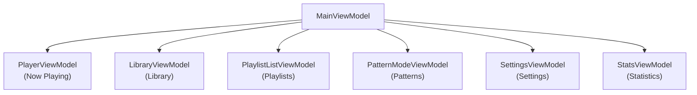

`MainViewModel.SelectedNavIndex` drives an overlay navigation pattern. The `PlayerView` is permanently in the visual tree; non-player pages are shown as overlays on top. The sidebar drives navigation by setting `SelectedNavIndex`. `ShowSidebar` is computed from `!IsFullscreen`.

### Keyboard Shortcuts

All shortcuts are customizable via `KeybindingMap` stored in `app_settings`. `MainWindow.OnKeyDown` resolves keys via `_keybindings.GetAction(keyName)`. Hot-reload supported: `SettingsViewModel.SaveKeybindingsAsync` calls `MainWindow.ReloadKeybindings()`.

Default bindings:

| Key | Action |
|---|---|
| `Space` | Play / Pause |
| `Escape` | Exit fullscreen (if in fullscreen) / Emergency Stop |
| `F11` / `F` | Toggle fullscreen |
| `Left Arrow` | Seek backward (configurable step, default 15s) |
| `Right Arrow` | Seek forward (configurable step, default 15s) |
| `N` | Next track |
| `P` | Previous track |
| `+` / `=` | Nudge offset +10ms |
| `-` | Nudge offset -10ms |
| `O` | Toggle override panel |
| `[` | Set A-B loop point A |
| `]` | Set A-B loop point B |
| `\` | Clear A-B loop |
| `Up Arrow` | Volume up |
| `Down Arrow` | Volume down |
| `M` | Toggle mute |
| `?` | Show shortcut help overlay |

### Fullscreen Mode

Fullscreen hides the sidebar and bottom action bar, leaving only the video and auto-hiding transport controls.

**Behavior:**
- Enter via `F11`, `F`, double-click on video area, or the fullscreen button in transport controls
- Exit via `Escape`, double-click, or fullscreen toggle button
- Transport controls (seekbar, play/pause, etc.) auto-hide after a configurable timeout (default 3 seconds, set in Settings > Playback)
- Mouse cursor hides with controls; both reappear on mouse movement
- Queue panel remains visible on the right side of the video in both normal and fullscreen modes
- Video margins and corner radius are removed for immersive edge-to-edge display
- On Windows, VLC's native HWND is made input-transparent (`WS_EX_TRANSPARENT`) so mouse events (double-click, pointer move) pass through to Avalonia's visual tree

**NativeControlHost limitation:** `MpvVideoView` is a `NativeControlHost` that owns a platform HWND. Native HWNDs render above Avalonia's visual tree — Avalonia controls cannot overlay the video. Transport controls are positioned below the video area; a collapsible 28px visualizer strip is placed in a Grid column to the *left* of the video container. An 8px transparent "hot zone" at the bottom triggers controls on non-Windows platforms.

**Script movement visualizer:** When a funscript is loaded, a toggle button reveals a narrow strip to the left of the video. A dot moves vertically in real time by calling `FunscriptInterpolator.GetNormalizedPosition` on mpv's position-change background thread, then assigning the result on the UI thread inside `Dispatcher.UIThread.Post` to avoid cross-thread Canvas access.

**Accent color system:** `AccentColors.Initialize()` registers static `SolidColorBrush` instances in `Application.Resources` before any UI controls are created. Calling `AccentColors.Apply()` or `ApplyCustomColor()` mutates `.Color` in-place — all `DynamicResource` bindings that resolve to these instances update instantly without needing to replace the brush object. Custom hex colors are saved as `#RRGGBB` strings in `app_settings`.

**Theme palette system:** `AppThemes.Initialize()` (called immediately after `AccentColors.Initialize()`) registers 6 additional mutable `SolidColorBrush` instances: `AppBgBrush`, `SurfaceBrush`, `CardBgBrush`, `CardBorderBrush`, `NowPlayingBgBrush`, `RowAltBrush`. `AppThemes.Apply(AppThemeOption)` mutates all 6 brush colors atomically and also calls `AccentColors.Apply()` with the theme's matching default accent. Five presets are built in: Dark Navy (default), AMOLED Black, Dark Gray, Dracula, Slate. `LoadAndApplyAppearance()` reads the saved theme and accent from the database synchronously before `MainWindow` is created, so the window renders with the correct colors immediately — no flash-of-default-theme.

---

## Testing Strategy

- **Framework**: xUnit v3 with `Assert.*` (no FluentAssertions)
- **Mocking**: NSubstitute for interfaces
- **Filesystem**: System.IO.Abstractions.TestingHelpers for testable file operations
- **Pattern**: Each test class covers one service with focused Arrange-Act-Assert tests

### Test Coverage (271 tests: 262 unit + 9 hardware-only)

| Test File | Service | Tests |
|---|---|---|
| FunscriptParserTests | JSON parsing, sorting, clamping | 7 |
| FunscriptInterpolatorTests | Position interpolation, normalized position, boundary cases | 16 |
| FilenameNormalizerTests | Tag stripping, normalization | 8 |
| PatternGeneratorTests | All pattern types, ranges, reproducibility | 6 |
| AutoPairingEngineTests | Matching rules, confidence, manual overrides | 8 |
| QueueServiceTests | Queue operations, reorder, shuffle, history, sort, repeat | 38 |
| PlaybackCoordinatorTests | State machine, load, play, device integration | 17 |
| ScriptTransformPipelineTests | All transforms, speed limit, range, invert, intensity | 13 |
| DispatcherTests | Handler resolution, validation, error handling | 13 |
| DeleteMediaFilesHandlerTests | Delete from disk, pairing cleanup, partial failure | 4 |
| ToggleWatchedHandlerTests | Mark watched/unwatched | 2 |
| ValidatorTests | All validators (playlists, presets, library, playback, device, pattern, settings) | 25 |
| HandyIntegrationTests | Handy API integration, script upload, time sync | 18 |
| HdspPipelineTests | HDSP pipeline, transform, fire-and-forget | 9 |
| HdspLiveDeviceTests | Hardware integration (requires physical device) | 10 |
| AccentColorsTests | Theme + accent color system, custom colors | 13 |
| MpvTrackTests | Audio/subtitle track parsing | 8 |
| ExportImportTests | Settings export/import V3, M3U format, value validation | 13 |
| PairingOffsetTests | Per-video script offset persistence | 3 |
| UpdatePairingOffsetHandlerTests | Pairing offset command handler | 3 |
| GetMissingFilesHandlerTests | Missing file detection | 5 |
| RelocateMediaFileHandlerTests | File relocation handler | 2 |

---

## Build & Configuration

### Prerequisites

- .NET 10 SDK (pinned via `global.json`)
- libmpv native library per platform (see below). The build copies it to the output directory from `runtimes/<rid>/native/`. Native binaries are not checked into git due to size — download them separately (see Development Setup in README.md).

### Build

```bash
dotnet build
```

### Run Tests

```bash
dotnet test
```

271 tests total: 262 unit tests + 9 hardware-dependent tests (require a physical Handy device, auto-skipped otherwise).

### Run Application

```bash
dotnet run --project src/HandyPlaylistPlayer.App
```

---

## Platform-Specific Build & Release

### Native Library: libmpv

The project uses libmpv via P/Invoke (`MpvInterop.cs`). Native binaries are resolved at runtime per platform from `runtimes/<rid>/native/` in the `Media.Mpv` project:

| Platform | File | Included in repo |
|---|---|---|
| Windows x64 | `runtimes/win-x64/native/libmpv-2.dll` | No — download from [mpv-player-windows](https://sourceforge.net/projects/mpv-player-windows/files/libmpv/) |
| macOS ARM64 | `runtimes/osx-arm64/native/libmpv.2.dylib` | No — must be copied from Homebrew |
| macOS x64 | `runtimes/osx-x64/native/libmpv.2.dylib` | No — must be copied from Homebrew |
| Linux x64 | `runtimes/linux-x64/native/libmpv.so.2` | No — must be copied from system package |

The `NativeLibrary.SetDllImportResolver` in `MpvInterop` tries platform-specific filenames in order (e.g., `libmpv.2.dylib`, `libmpv.dylib`, `mpv` on macOS).

### Windows x64

**Prerequisites:**

```powershell
# Download libmpv-2.dll from https://sourceforge.net/projects/mpv-player-windows/files/libmpv/
# Place it at: src/HandyPlaylistPlayer.Media.Mpv/runtimes/win-x64/native/libmpv-2.dll
```

```powershell
./publish-win.ps1
```

**Outputs:** `publish/HandyPlayer-1.0.0-win-x64.zip` (portable) and `.msi` installer (requires [WiX Toolset v5](https://wixtoolset.org/)).

### macOS ARM64 (Apple Silicon)

**Prerequisites:**

```bash
# Install libmpv
brew install mpv

# Copy dylib into project — dotnet publish bundles it automatically
mkdir -p src/HandyPlaylistPlayer.Media.Mpv/runtimes/osx-arm64/native
cp "$(brew --prefix mpv)/lib/libmpv.2.dylib" src/HandyPlaylistPlayer.Media.Mpv/runtimes/osx-arm64/native/
```

If the dylib isn't at the Homebrew prefix, find it: `find /opt/homebrew -name "libmpv*.dylib" 2>/dev/null`

**Build & package:**

```bash
chmod +x publish-mac.sh
./publish-mac.sh
```

**Outputs:** `publish/HandyPlayer-1.0.0-mac-arm64.zip` (portable) and `.dmg` installer.

**What the script does:**
1. `dotnet publish` as self-contained for `osx-arm64`
2. Creates `.app` bundle (Contents/MacOS + Contents/Resources)
3. Generates `.icns` icon via `sips` + `iconutil`
4. **Ad-hoc signs all native dylibs and the main executable** — required on Apple Silicon, unsigned binaries are rejected by the kernel
5. Creates a DMG with Applications symlink for drag-install

**macOS-specific code notes:**
- `MpvVideoView` calls `[NSView setWantsLayer:YES]` via ObjC runtime on the NativeControlHost view — required for mpv GPU rendering to embed properly
- `MpvMediaPlayerAdapter` forces `--gpu-api=opengl` on macOS — Vulkan/Metal GPU contexts don't reliably embed into an existing NSView via `--wid`
- `--wid` is set as the NSView pointer (int64 string) before `mpv_initialize()`
- Settings UI disables Windows-only GPU API options (d3d11) and macOS-only features (MetalFX) per platform

**Development builds (without publish script):**

```bash
dotnet build
# Sign the native libraries (required on Apple Silicon)
find src/HandyPlaylistPlayer.App/bin -name "*.dylib" -exec codesign --force --sign - {} \;
# Must use self-contained runtime to avoid library validation issues
dotnet run --project src/HandyPlaylistPlayer.App -r osx-arm64
```

The shared `dotnet` host from Microsoft has library validation enabled and rejects ad-hoc signed dylibs. Using `-r osx-arm64` builds with the app's own host binary which accepts them.

### Linux x64

**Prerequisites:**

```bash
# Debian/Ubuntu
sudo apt install libmpv-dev

# Copy into project
mkdir -p src/HandyPlaylistPlayer.Media.Mpv/runtimes/linux-x64/native
cp /usr/lib/x86_64-linux-gnu/libmpv.so.2 src/HandyPlaylistPlayer.Media.Mpv/runtimes/linux-x64/native/
# Path varies by distro — use: find /usr -name "libmpv.so*" to locate
```

**Build & package:**

```bash
chmod +x publish-linux.sh
./publish-linux.sh
```

**Outputs:** `publish/HandyPlayer-1.0.0-linux-x64.tar.gz` (portable), `.deb` package, and optionally `.AppImage` (if `appimagetool` is installed).

### Cross-Platform Considerations

| Concern | Windows | macOS | Linux |
|---|---|---|---|
| libmpv | Download from SourceForge + manual copy | Homebrew + manual copy | Package manager + manual copy |
| Code signing | Not required | Ad-hoc signing required (Apple Silicon) | Not required |
| GPU API | `auto` (picks d3d11/vulkan/opengl) | Forced to `opengl` for embedding | `auto` |
| NativeControlHost | Custom HWND with black background | NSView with `wantsLayer=YES` | Default X11/Wayland view |
| Input transparency | Win32 `WS_EX_TRANSPARENT` on child HWNDs | Not needed (Avalonia handles events) | Not needed |
| Data directory | `%APPDATA%\HandyPlayer\` | `~/Library/Application Support/HandyPlayer/` | `~/.config/HandyPlayer/` (via XDG) |
| Logs directory | `%APPDATA%\HandyPlayer\logs\` | `~/Library/Application Support/HandyPlayer/logs/` | `~/.config/HandyPlayer/logs/` |
